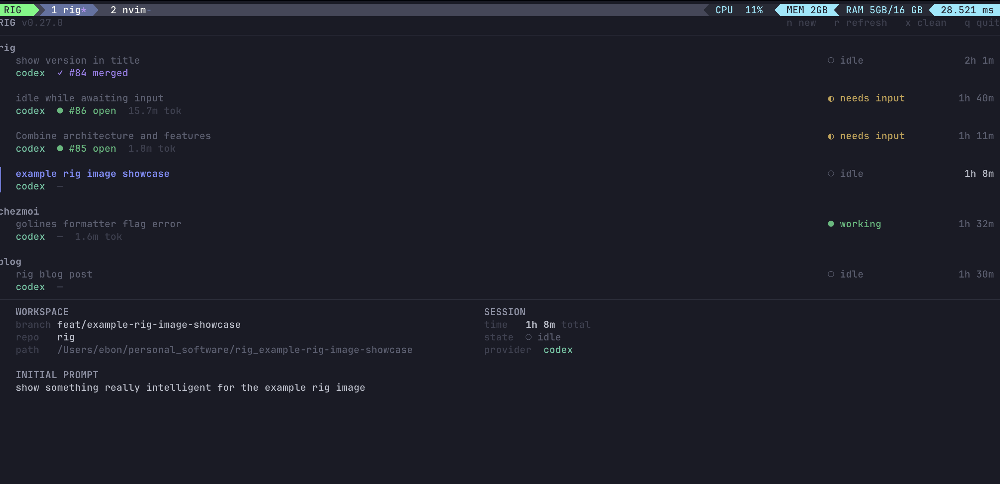

# Rig

`rig` is a local terminal app for running AI-assisted coding tasks in isolated
git worktrees and tmux sessions.

Rig gives each task its own workspace, branch, terminal session, provider
runtime (Codex or Claude Code), and durable task record. The foreground TUI
stays focused on browsing, creating, attaching to, and cleaning up tasks while
a background daemon handles longer running orchestration.



## Features

- **Task dashboard**: browse all known tasks in a terminal UI grouped by
  repository, with live status, PR state, elapsed time, and token usage.
- **Prompt-backed task creation**: start a new task from a prompt; the selected
  provider suggests a task name, then Rig creates the branch and worktree,
  prepares the workspace, and starts the tmux session.
- **Multi-provider support**: enable Codex and Claude Code through `rig setup`,
  pick a default provider, cycle providers with `tab` while creating a task, and
  switch an existing task to another configured provider.
- **Pull request-backed task creation**: pick an open GitHub pull request and
  create a local task workspace for reviewing or continuing that branch.
- **Isolated workspaces**: every task runs in its own git worktree so parallel
  tasks do not collide with the main checkout or each other.
- **Tmux sessions**: attach to any task from the TUI, reconnect missing sessions
  from provider resume metadata, and keep work running outside the foreground
  `rig` process.
- **Provider integration**: Rig starts the task's active provider, installs
  local hooks, captures session and activity events, and stores compact task
  history for the detail view.
- **Live observability**: the daemon records task status, recent prompt and
  assistant activity, provider sessions, transcript metadata, and token usage in
  SQLite.
- **Retry and cleanup**: retry failed task setup from the recorded creation step
  or remove a task's tmux session and worktree while keeping its branch.
- **Workspace seeding**: copy repo-local files and run a repo-local setup script
  in each new task workspace through `.rig.yaml`.
- **Environment checks**: `rig doctor` verifies the local tools Rig depends on.

## Install

Install the latest GitHub release on macOS or Linux:

```bash
curl -fsSL https://raw.githubusercontent.com/BaronBonet/rig/main/scripts/install.sh | sh
```

The installer places `rig` in `~/.local/bin` and adds it to your `PATH`
automatically for zsh and bash.

On macOS, if the system blocks the binary on first run, clear the quarantine flag
once:

```bash
xattr -d com.apple.quarantine ~/.local/bin/rig
```

## Requirements

`rig` expects these binaries to be available on `PATH`:

- `git`
- `tmux`
- at least one supported provider CLI: `codex` and/or `claude`
- `gh` (optional, needed for PR-backed task creation and PR status checks)

Provider binaries can live in nonstandard locations: set `RIG_CODEX_BINARY`
and/or `RIG_CLAUDE_BINARY` to point Rig at them.

## Provider Setup

Rig supports two providers: **Codex** and **Claude Code**. A provider Rig knows
how to integrate with is a *supported* provider; a provider you have enabled is
a *configured* provider. Each task has exactly one *active* provider at a time,
and new tasks start with your *default* provider.

Provider setup is mandatory: the first time you launch `rig` (or whenever your
provider config is missing or invalid) the TUI opens the setup screen before
normal task use. Setup detects which supported providers work on your machine
using the same checks task creation depends on, installs or repairs the hook
forwarding each provider needs, and requires you to enable at least one
provider and choose a default.

Rerun setup at any time to add or remove providers; your existing choices are
preserved and edited incrementally:

```bash
rig setup
```

Provider setup is stored in user-level config at `~/.config/rig/config.json`
(override with `RIG_USER_CONFIG_PATH`), never in the task database, and
repo-level default provider configuration is not supported. See
[ADR 0001](docs/adr/0001-provider-setup-in-user-config.md) for the reasoning.

`RIG_PROVIDER` overrides the default provider for a single run. It must name a
configured provider; it cannot bypass setup:

```bash
RIG_PROVIDER=claude rig
```

`rig doctor` validates every configured provider. Supported providers you have
not configured are ignored, so a missing `claude` binary never fails doctor
unless you enabled Claude.

## Provider Hooks

Rig uses provider hooks to capture live task status, recent activity, provider
session metadata, transcript paths, and token usage.

### Codex

Enable hooks in `~/.codex/config.toml`:

```toml
[features]
hooks = true
```

Rig installs and updates its own Codex hook forwarding entries automatically
(in `~/.codex/hooks.json`) during provider setup and when it starts task
sessions. The forwarding hooks post local Codex events to Rig's background
daemon; other Codex hooks and plugins can remain enabled.

### Claude Code

Claude hook registration is workspace-scoped. Provider setup installs only a
shared forward-to-rig script under `~/.local/share/rig/claude/`; that script
does nothing by itself. When Rig prepares a task workspace it writes an
untracked `.claude/settings.local.json` into the task worktree that registers
Rig's hooks for that workspace only. The file is written into every Rig task
workspace — not just tasks whose active provider is Claude — so manually
launching Claude in any Rig task is observed and adopted. If the file already
exists (Claude Code stores permission decisions in it), Rig merges its hook
entries in and preserves everything else. Rig never modifies your user-level
`~/.claude/settings.json`, so Claude sessions outside Rig workspaces are never
observed by or reported to Rig. The workspace settings file is untracked, so it
never shows up in diffs or pull requests.

Token usage and recent activity for Claude tasks are read from Claude Code
transcripts, the same overview Codex tasks get: the last user prompt and
recent assistant messages are recovered from the transcript even when hook
events were lost, for example while the daemon was restarting.

### Status semantics

Task status is eventually consistent with provider hook delivery. Rig does not
watch tmux keystrokes or infer state from text typed into a task session. If a
task still shows `needs input` after you submit a prompt, Rig has not yet
received the next provider hook, such as `UserPromptSubmit`, `PreToolUse`, or
`PostToolUse`, that marks the task as working.

Use `rig doctor` to verify that your configured providers are available and
that Rig's hook forwarding is installed correctly.

## Usage

Launch the terminal UI from a git repository:

```bash
rig
```

Create a task with `n`, enter a prompt, and press `enter`. While composing,
press `tab` to cycle through your configured providers (a no-op when only one
is configured); the selected provider owns the task name suggestion, branch
type, and session. Use `ctrl+p` from the prompt view to create from a GitHub
pull request instead — PR-backed tasks use the selected provider too.

Common TUI keys:

| Key | Action |
|-----|--------|
| `n` | Create a task from a prompt |
| `tab` | Cycle configured providers while composing a task |
| `ctrl+p` | Pick a GitHub pull request while creating a task |
| `enter` | Attach to the selected task's tmux session |
| `p` | Switch the selected task to another configured provider |
| `r` | Refresh task data |
| `R` | Retry a failed task creation |
| `x` | Clean up the selected task's tmux session and worktree |
| `q` | Quit |

Check environment health:

```bash
rig doctor
```

Manage the background task daemon:

```bash
rig daemon status
rig daemon start
rig daemon stop
rig daemon restart
```

## Switching Providers

Each task row and the detail panel show the task's active provider. Press `p`
on a task to switch it to another configured provider. Switching:

- refuses while the current provider process is still running in the task pane
  (exit the provider first; Rig never kills an interactive session),
- bootstraps the existing workspace for the new provider without rerunning
  repo seeding or setup scripts,
- launches the new provider with an empty prompt so you decide what context to
  give it, and
- records the new active provider only after the launch succeeds — a failed
  switch leaves the task unchanged.

You can also switch manually: exit the provider in the task session and start
another configured provider yourself (for example, type `claude` in a Codex
task's workspace). Rig adopts the manually launched provider as the task's
active provider when it observes that provider's session-start hook from the
task workspace. Hooks from providers you have not configured are ignored, and
late hooks from a previous provider never drive the task's current status.

Tasks whose active provider is no longer configured stay visible so you can
browse, inspect, and clean them up; provider-dependent actions on them report a
clear error until you re-enable the provider with `rig setup`.

Reconnecting a lost tmux session resumes the active provider by its recorded
session ID when available and launches the provider fresh otherwise.

## Workspace Seeding

Configure repository-specific workspace setup with a `.rig.yaml` file in the
repo root:

```yaml
seed:
  copy:
    - .env
    - local/
  setup_script: scripts/worktree-setup.sh
```

- `seed.copy` copies repo-relative files or directories into the new worktree.
- Symlinks inside copied directories are followed only when they resolve within
  the repo root; symlinks that resolve outside the repo are rejected.
- `seed.setup_script` runs a repo-relative script inside the new worktree after
  copying completes.
- Paths in `.rig.yaml` must be repo-relative. Absolute paths, `..`, and glob
  patterns are rejected.

## Troubleshooting

### `task daemon did not become healthy` on startup

```
task daemon did not become healthy: context deadline exceeded
dial unix ~/.local/share/rig/daemon.sock: connect: no such file or directory
```

The foreground `rig` process spawns the background daemon and waits a few
seconds for it to answer a health probe; this error means the daemon was not
ready before that wait expired.

The most common trigger is starting `rig` right after upgrading or rebuilding
it while a daemon from the previous binary is still running. The TUI and
daemon must be the same build (see
[ADR 0002](docs/adr/0002-version-locked-socket-protocol.md)), so `rig` detects
the version mismatch, stops the old daemon, and spawns a new one — and on a
slow transition the fresh daemon can become healthy just after `rig` stops
waiting.

To resolve:

1. **Run `rig` again.** The spawned daemon usually finishes starting on its
   own, so the retry connects immediately. Verify with:

   ```bash
   rig daemon status
   ```

2. **Force a clean restart** if the daemon still is not healthy:

   ```bash
   rig daemon restart
   ```

3. **Check the startup log** if restarts keep failing — a daemon that crashes
   during startup writes the reason here:

   ```bash
   cat ~/.local/share/rig/daemon-startup.log
   ```

   Common startup failures are another process holding the hook port
   (`127.0.0.1:4124`) and a locked or corrupted task database
   (`~/.local/share/rig/tasks.db`).

A stale socket file is not a problem on its own: the daemon removes and
recreates `daemon.sock` when it starts, and `rig` replaces daemons whose
protocol or build version no longer matches automatically.

## Architecture

Rig is split between a foreground terminal UI and a background task daemon. The
daemon owns task creation, local state, provider hooks, and live update streams.


| Component | Role |
|-----------|------|
| **TUI** | The foreground interface for creating tasks, browsing task state, and attaching to running work. |
| **Background task daemon** | A long-lived `rig` process that creates tasks, starts or resumes providers, records status, and serves updates back to the TUI. |
| **Unix socket server** | The local control channel between the TUI and daemon. It carries commands such as creating tasks and streams live task updates back to the TUI. |
| **HTTP hook server** | A loopback-only endpoint used by provider hooks to report session, prompt, tool, and stop events back to Rig. Routes exist for every supported provider. |
| **SQLite** | The local task database. It stores task records, latest status, activity snippets, token usage, and resume metadata. |
| **Provider CLI** | The provider (Codex or Claude Code) Rig starts for each task. It runs in an isolated task workspace and sends hook events back to the daemon. |

When you launch `rig`, the foreground process ensures the task daemon is running
and then opens the TUI. The TUI talks to the daemon over a local Unix socket
instead of doing task orchestration itself.

When you create a task, the daemon prepares the isolated workspace, starts or
resumes the task's active provider, records the task in SQLite, and streams
status updates back to the TUI. Provider hook events are posted to the daemon's
local HTTP hook server, which updates SQLite and any active TUI subscriptions.

This split keeps the terminal UI responsive while task setup, provider
sessions, and status collection continue in the background.
