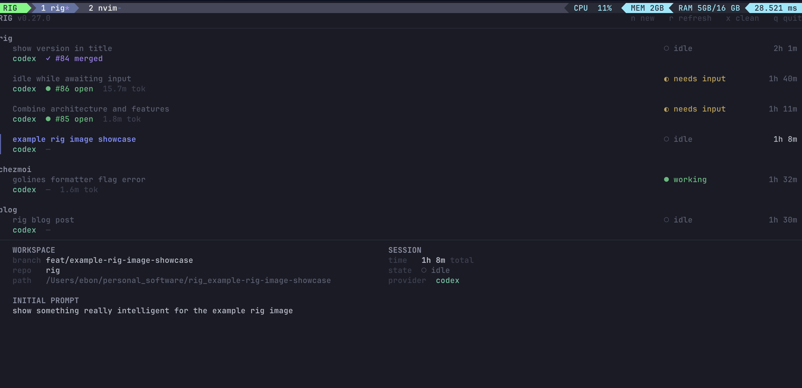
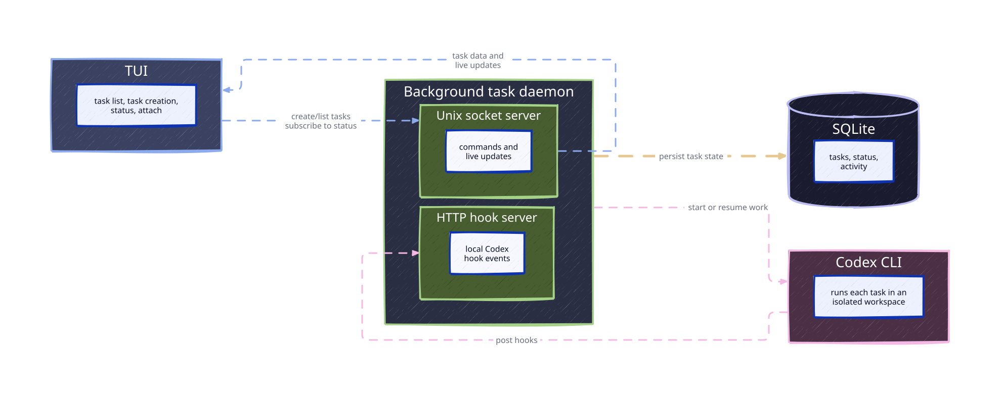

# Rig

`rig` is a local terminal app for running AI-assisted coding tasks in isolated
git worktrees and tmux sessions.

Rig gives each task its own workspace, branch, terminal session, provider
runtime (Codex or Claude Code), and durable task record. The foreground TUI
stays focused on browsing, creating, attaching to, and cleaning up tasks while
a background daemon handles longer running orchestration.



## Features

- **Task dashboard**: browse all known tasks in a terminal UI grouped by
  repository, with live status, PR state, elapsed time, and token usage.
- **Prompt-backed task creation**: start a new task from a prompt; the selected
  provider suggests a task name, then Rig creates the branch and worktree,
  prepares the workspace, and starts the tmux session with the model and
  effort you picked.
- **Sessions per task**: start a fresh provider session in an existing task
  when its context has grown, from a handoff note the previous session
  writes, instead of compacting. The task stays one row however many
  sessions it takes.
- **Multi-provider support**: enable Codex and Claude Code through `rig setup`,
  pick a default provider, cycle providers with `tab` while creating a task, and
  switch an existing task to another configured provider.
- **Pull request-backed task creation**: pick an open GitHub pull request and
  create a local task workspace for reviewing or continuing that branch.
- **Isolated workspaces**: every task runs in its own git worktree so parallel
  tasks do not collide with the main checkout or each other.
- **Folder tasks**: run a task in an existing folder as it is, Git or not, for
  sessions that work across several repositories from a parent folder.
- **Tmux sessions**: attach to any task from the TUI, reconnect missing sessions
  from provider resume metadata, and keep work running outside the foreground
  `rig` process.
- **Provider integration**: Rig starts the task's active provider, installs
  local hooks, captures session and activity events, and stores compact task
  history for the detail view.
- **Live observability**: the daemon records task status, recent prompt and
  assistant activity, provider sessions, transcript metadata, and token usage in
  SQLite.
- **Worktrees per task**: see which worktrees and branches each task is editing,
  across repositories, read from provider transcripts including subagents.
- **Retry and cleanup**: retry failed task setup from the recorded creation step
  or remove a task's tmux session and worktree while keeping its branch.
- **Workspace seeding**: copy repo-local files and run a repo-local setup script
  in each new task workspace through `.rig.yaml`.
- **Environment checks**: `rig doctor` verifies the local tools Rig depends on.

## Install

Install the latest GitHub release on macOS or Linux:

```bash
curl -fsSL https://raw.githubusercontent.com/BaronBonet/rig/main/scripts/install.sh | sh
```

The installer places `rig` in `~/.local/bin` and adds it to your `PATH`
automatically for zsh and bash.

On macOS, if the system blocks the binary on first run, clear the quarantine flag
once:

```bash
xattr -d com.apple.quarantine ~/.local/bin/rig
```

## Requirements

`rig` expects these binaries to be available on `PATH`:

- `git`
- `tmux`
- at least one supported provider CLI: `codex` and/or `claude`
- `gh` (optional, needed for PR-backed task creation and PR status checks)

Provider binaries can live in nonstandard locations: set `RIG_CODEX_BINARY`
and/or `RIG_CLAUDE_BINARY` to point Rig at them.

## Provider Setup

Rig supports two providers: **Codex** and **Claude Code**. A provider Rig knows
how to integrate with is a *supported* provider; a provider you have enabled is
a *configured* provider. Each task has exactly one *active* provider at a time,
and new tasks start with your *default* provider.

Provider setup is mandatory: the first time you launch `rig` (or whenever your
provider config is missing or invalid) the TUI opens the setup screen before
normal task use. Setup detects which supported providers work on your machine
using the same checks task creation depends on, installs or repairs the hook
forwarding each provider needs, and requires you to enable at least one
provider and choose a default.

Rerun setup at any time to add or remove providers; your existing choices are
preserved and edited incrementally:

```bash
rig setup
```

Provider setup is stored in user-level config at `~/.config/rig/config.json`
(override with `RIG_USER_CONFIG_PATH`), never in the task database, and
repo-level default provider configuration is not supported. See
[ADR 0001](docs/adr/0001-provider-setup-in-user-config.md) for the reasoning.

`RIG_PROVIDER` overrides the default provider for a single run. It must name a
configured provider; it cannot bypass setup:

```bash
RIG_PROVIDER=claude rig
```

`rig doctor` validates every configured provider. Supported providers you have
not configured are ignored, so a missing `claude` binary never fails doctor
unless you enabled Claude.

### Several provider accounts

Every `rig` window shares one daemon, but each window keeps the provider
configuration of the terminal it was started in: `CLAUDE_CONFIG_DIR` for Claude
Code and `CODEX_HOME` for Codex, for example as set by a direnv `.envrc` in a
client's folder. The import picker lists sessions from that window's
configuration, and every task it creates or imports runs its provider with it,
including after a reconnect or a provider switch. A variable the window left
unset gives the provider's default (`~/.claude`, `~/.codex`) even when the
daemon, the tmux server or a direnv hook in the task's folder sets another.

Rig starts the provider as `env CLAUDE_CONFIG_DIR=… claude` (or
`env -u CLAUDE_CONFIG_DIR claude`) and also sets the variables on the task's
tmux session, so a provider you start by hand there uses the same account.
Tasks created before this existed keep using the daemon's environment.

## Provider Hooks

Rig uses provider hooks to capture live task status, recent activity, provider
session metadata, transcript paths, and token usage.

### Codex

Enable hooks in `~/.codex/config.toml`:

```toml
[features]
hooks = true
```

Rig installs and updates its own Codex hook forwarding entries automatically
(in `~/.codex/hooks.json`) during provider setup and when it starts task
sessions. The forwarding hooks post local Codex events to Rig's background
daemon; other Codex hooks and plugins can remain enabled.

### Claude Code

Claude hook registration is workspace-scoped. Provider setup installs only a
shared forward-to-rig script under `~/.local/share/rig/claude/`; that script
does nothing by itself. When Rig prepares a task workspace it writes an
untracked `.claude/settings.local.json` into the task worktree that registers
Rig's hooks for that workspace only. The file is written into every Rig task
workspace — not just tasks whose active provider is Claude — so manually
launching Claude in any Rig task is observed and adopted. If the file already
exists (Claude Code stores permission decisions in it), Rig merges its hook
entries in and preserves everything else. Rig never modifies your user-level
`~/.claude/settings.json`, so Claude sessions outside Rig workspaces are never
observed by or reported to Rig. The workspace settings file is untracked, so it
never shows up in diffs or pull requests.

Token usage and recent activity for Claude tasks are read from Claude Code
transcripts, the same overview Codex tasks get: the last user prompt and
recent assistant messages are recovered from the transcript even when hook
events were lost, for example while the daemon was restarting.

### Status semantics

Task status is eventually consistent with provider hook delivery. Rig does not
watch tmux keystrokes or infer state from text typed into a task session. If a
task still shows `needs input` after you submit a prompt, Rig has not yet
received the next provider hook, such as `UserPromptSubmit`, `PreToolUse`, or
`PostToolUse`, that marks the task as working.

When a Claude task ends its turn while background work it started is still
running (subagents, background shells, Monitor watches, workflows), Rig shows
the task as working in the background, for example `1 subagent working`,
instead of `needs input`. Claude wakes the task when that work finishes, and
the next turn end updates the status. Monitor watches appear as shells, and a
backgrounded long-running process such as a dev server keeps the task working
until it exits.

A session Rig resumes, on import or reconnect, shows `needs input` once the
provider reports it has started: it reopens idle at its prompt, waiting for you.

Use `rig doctor` to verify that your configured providers are available and
that Rig's hook forwarding is installed correctly.

### Folder tasks

Press `ctrl+o` while composing a task to run it in the folder you launched
`rig` from instead of a new worktree. Outside a Git repository this is the only
option. A folder task gets its own tmux session but no branch: Rig never seeds
the folder, never removes it on cleanup (`x` only ends the session), and groups
folder tasks under the folder's path. Several tasks can share one folder;
their hook events are told apart by the `RIG_TASK_ID` each session exports, so
provider sessions you start in that folder outside Rig are never attributed to
a task.

### Importing sessions

Press `i` to list the Claude Code and Codex sessions that were started in the
folder you launched `rig` from, or in any folder below it, and do not belong to
a task yet, newest first, named the way the provider names them. A session
started in a subfolder shows that subfolder before its name. Every session is
listed however old; press `/` and type to narrow them to those whose name,
subfolder or provider contains every word you type. Importing one
creates a folder task in the folder the session was started in and resumes the
session in the task's own tmux session (`claude --resume <id>` or
`codex resume <id>`), with its history, token usage and worktrees already
known. Close the session where it was running first: one conversation must not
run in two places. If the session fails to start, the task is still created and
`enter` retries.

Rig never imports on its own, but an empty dashboard says how many sessions in
the launch folder can be imported.

### Tokens per task

A task row shows its most recently active session: how full its context is
(`ctx`), how many tokens it has written (`out`), how many times it has been
compacted, and every token it has processed, cache reads included (`total`).
`/compact` keeps the session, so the total runs across compactions.

Every request re-reads the whole cached conversation, so the context is what
the next request costs. It turns amber at 200k, when a reset is worth it at the
next break, and red at 400k. `/compact` and a new session from a handoff note
(`N`) both bring it back to about a fresh session's size, so they cost about
the same. What tells them apart is the compaction count: each compaction
summarises the last one, so a session compacted many times is due for a new
session with a deliberate note. The detail view sums the counts over all of
the task's sessions.

### Worktrees per task

A task row lists the worktrees its provider sessions have edited, most recently
edited first, and the detail view shows each one's repository and the branch it
has checked out now. Edits are read from provider transcripts, including Claude
Code subagent transcripts, so a task that works across several repositories and
worktrees shows all of them.

- A deleted worktree disappears from the list; a new one appears on its first
  edit.
- Rig remembers the branch a worktree had at the task's latest edit there. If
  the worktree has since checked out another branch, usually because other work
  reused it, it is dimmed and reads "now on `<branch>`". The task's next edit
  there adopts the new branch.
- Only file edit tools count (Claude Code Edit/Write/MultiEdit/NotebookEdit,
  Codex patches). Files changed through shell commands are not tracked, and
  Codex subagent edits are not included.

## Usage

Launch the terminal UI from a git repository:

```bash
rig
```

Every `rig` window shares one task list, but a window shows only the tasks of
the folder it was launched in: those whose repository or folder is that folder,
lies below it, or contains it. A line under the header counts the tasks of
other folders, and `f` shows or hides them, so a `rig` per client folder stays
separate.

Create a task with `n`, enter a prompt, and press `enter`. While composing,
press `tab` to cycle through your configured providers (a no-op when only one
is configured); the selected provider owns the task name suggestion, branch
type, and session. `ctrl+t` cycles the model and `ctrl+r` the effort the
provider starts with (see [Model and effort](#model-and-effort)). Use `ctrl+p`
from the prompt view to create from a GitHub pull request instead — PR-backed
tasks use the selected provider too.

The prompt is typed into the provider's input, not submitted, once the
provider reports that its session has started (its session-start hook), so a
shell prompt that happens to use the same `❯` character, or a folder trust
dialog, cannot swallow it. If the provider is still held up by a dialog after
twenty seconds, the task is created anyway and the prompt is typed as soon as
the session starts; it also stays on the task's detail view.

Common TUI keys:

| Key | Action |
|-----|--------|
| `n` | Create a task from a prompt |
| `N` | Start a fresh session in the selected task |
| `tab` | Cycle configured providers while composing a task |
| `ctrl+t` | Cycle the model while composing |
| `ctrl+r` | Cycle the effort while composing |
| `alt+enter` | Start a new line in the prompt (`shift+enter` too, inside tmux only with `extended-keys` on) |
| `ctrl+g` | Toggle the handoff note while composing a new session |
| `ctrl+w` | Replace the running session in its window instead of opening a new one |
| `ctrl+p` | Pick a GitHub pull request while creating a task |
| `ctrl+o` | Run the new task in this folder instead of a new worktree |
| `enter` | Attach to the selected task's tmux session |
| `d` | Shelve the selected task, or put it back from the shelf |
| `e` | Rename the selected task |
| `tab` | Switch the list between the current tasks and the shelf |
| `i` | Import a provider session started in this folder outside Rig |
| `p` | Switch the selected task to another configured provider |
| `r` | Refresh task data |
| `f` | Show the tasks of every folder, or only this folder's |
| `R` | Retry a failed task creation |
| `x` | Clean up the selected task's tmux session and worktree |
| `q` | Quit |

Run `rig` inside tmux: `enter` moves your tmux client to the task's session.
To come back, press your tmux prefix and then `b`. Rig binds that key the
first time it opens a task, and it returns to the rig window that opened the
task you are in, or to the rig you used last from any other session. Set
`RIG_TMUX_RETURN_KEY` to use another key, or to `none` to leave your tmux key
bindings alone.

Check environment health:

```bash
rig doctor
```

Manage the background task daemon:

```bash
rig daemon status
rig daemon start
rig daemon stop
rig daemon restart
```

## Model and effort

While composing a task, `ctrl+t` cycles the model and `ctrl+r` the effort the
provider starts with; `default` leaves the choice to the provider. Claude Code
offers its model aliases (`fable`, `opus`, `sonnet`, `haiku`) and efforts
(`low` to `max`), passed as `claude --model` and `--effort`; Codex offers its
models and reasoning efforts, passed as `codex -m` and
`-c model_reasoning_effort=…`. The choice is kept on the task, so a reconnect
resumes the session with the same options, and shown in the detail view.

The options a provider was last launched with are preselected the next time
you compose with it; they live in `~/.config/rig/config.json` under
`launch_defaults`, next to provider setup.

## Sessions per task

A task is the durable unit — branch, worktree, tmux session, history — and may
run many provider sessions over time. When a session's context has grown to
the point where every turn re-reads hundreds of thousands of tokens, a fresh
session that starts from a short handoff note is cheaper and sharper than
compacting, and keeps the task as one row.

Press `N` on the task. The composer shows the continuation prompt the new
session will start with — the task, its original ask, and where to pick up
its state — and a box for your own instruction for this session, which is
optional and goes last under `Now:`. The task's model and effort are
preselected; `tab`, `ctrl+t` and `ctrl+r` change them.

With `handoff` on (the default for Claude Code), Rig first runs the previous
session once more in print mode and asks it for a handoff note — goal, state,
decisions, where things are, gotchas, next step — told what your instruction
for the next session is, so the note covers what that session needs. The note
is saved under `~/.local/share/rig/handoffs/<task id>/`. The session is forked
and not saved, with workspace hooks and tools off, so the previous
conversation is left exactly as it was and nothing but the note comes out. The
continuation prompt then points at the note; without a handoff it asks the
session to recover the state from the workspace first. `ctrl+g` skips the
handoff; a task without a previous session skips it on its own. Codex cannot
write handoff notes yet.

`where` decides what happens to the running session:

- **new window** (the default) leaves it as it is and starts the new session
  alongside, in a new window of the task's tmux session. The new session
  becomes a row listed under the task (`↳`), with its own status, activity
  and token usage, and `enter` on it lands in its window. The previous
  session keeps running in its own window whether or not you go back to it;
  the handoff note is written from it while it is open. This also splits a
  larger task across several sessions at once: each gets the same workspace
  and branch, the handoff note, and its own instruction. A session started
  from one of these rows joins the same group. `x` on a session row closes
  only its window; cleaning up the task closes them all.
- **this window** (`ctrl+w`) replaces it: Rig types the provider's own exit
  command (`/exit` for Claude Code, `/quit` for Codex) into the session once
  the handoff note is written, waits for it to leave, and starts the new
  session in its place. The task keeps its row, now with one more session
  behind it. A session still in a turn is never cut off: Rig refuses and
  says so, so wait for it to finish or use a new window.

Choosing another provider with `tab` switches the task to it, as `p` does, and
starts the new session there.

You can also start a session by hand: exit the provider and run `claude` or
`codex` in the task's tmux window. Rig adopts the new session into the same
task, with its history and token usage, and reconnects resume the latest one.

## Shelf

The list is for what you are working on now. `d` takes the selected task off
it and onto the shelf; `tab` switches the list between the current tasks and
the shelf, and the line under the header says how many are shelved.

Shelving closes the task's tmux session, ending its provider sessions and
anything else running in its windows, which frees the memory they hold. It
keeps everything else: the record and its sessions, the model and effort,
activity, token usage, the branch and the worktree. Unlike `x`, nothing is
removed. A task moves with the sessions listed under it, and `d` on a session
row shelves only that session and closes its window. Rig refuses while any of
them is in a turn, so no work is cut off.

On the shelf, `enter` puts the task back on the current list and opens it,
resuming its latest session, as a reconnect would; `d` puts it back without
starting anything, so the session resumes when you next open it. Starting,
importing or switching work happens on the current list, and `esc` returns to
it.

## Renaming

When you reuse a task for something else, give it a new name: `e` edits the
selected task's name in place, on the list or the shelf. Renaming the task's
Claude session with `/rename` does the same, and the task takes the new title
at the session's next prompt or turn end. A session renames its task only when
its title changes, so a name you give in Rig is not undone by an older title.

A rename drops the task's original ask, which every new session (`N`) quotes,
so new sessions are not briefed on what the task was first for; they start
from the handoff note and the workspace. Only the name changes: the branch,
worktree and tmux session keep theirs.

## Switching Providers

Each task row and the detail panel show the task's active provider. Press `p`
on a task to switch it to another configured provider. Switching:

- refuses while the current provider process is still running in the task pane
  (exit the provider first; Rig never kills an interactive session),
- bootstraps the existing workspace for the new provider without rerunning
  repo seeding or setup scripts,
- launches the new provider with an empty prompt so you decide what context to
  give it, and
- records the new active provider only after the launch succeeds — a failed
  switch leaves the task unchanged.

You can also switch manually: exit the provider in the task session and start
another configured provider yourself (for example, type `claude` in a Codex
task's workspace). Rig adopts the manually launched provider as the task's
active provider when it observes that provider's session-start hook from the
task workspace. Hooks from providers you have not configured are ignored, and
late hooks from a previous provider never drive the task's current status.

Tasks whose active provider is no longer configured stay visible so you can
browse, inspect, and clean them up; provider-dependent actions on them report a
clear error until you re-enable the provider with `rig setup`.

Reconnecting a lost tmux session resumes the active provider by its recorded
session ID when available and launches the provider fresh otherwise.

## Workspace Seeding

Configure repository-specific workspace setup with a `.rig.yaml` file in the
repo root:

```yaml
seed:
  copy:
    - .env
    - local/
  setup_script: scripts/worktree-setup.sh
```

- `seed.copy` copies repo-relative files or directories into the new worktree.
- Symlinks inside copied directories are followed only when they resolve within
  the repo root; symlinks that resolve outside the repo are rejected.
- `seed.setup_script` runs a repo-relative script inside the new worktree after
  copying completes.
- Paths in `.rig.yaml` must be repo-relative. Absolute paths, `..`, and glob
  patterns are rejected.

### Base branch and worktree names

The same file sets where new worktree tasks start and what their folders are
called:

```yaml
base_branch: develop
worktree_name: "{repo}-{slug}"
```

- `base_branch` fetches the branch from `origin` and starts each new task
  branch from `origin/<branch>`, falling back to the local branch when the
  fetch fails. Without it, tasks start from whatever the main checkout has
  checked out. Task branches never track the base branch, so a bare `git push`
  cannot land on it.
- `worktree_name` names the worktree folder created next to the repository from
  `{repo}` and `{slug}`; it must contain `{slug}` and name a single folder. The
  default is `{repo}_{slug}`. Session names are unaffected.

`.rig.yaml` is read from the main checkout, so it can stay untracked there.

## Troubleshooting

### `task daemon did not become healthy` on startup

```
task daemon did not become healthy: context deadline exceeded
dial unix ~/.local/share/rig/daemon.sock: connect: no such file or directory
```

The foreground `rig` process spawns the background daemon and waits a few
seconds for it to answer a health probe; this error means the daemon was not
ready before that wait expired.

The most common trigger is starting `rig` right after upgrading or rebuilding
it while a daemon from the previous binary is still running. The TUI and
daemon must be the same build (see
[ADR 0002](docs/adr/0002-version-locked-socket-protocol.md)), so `rig` detects
the version mismatch, stops the old daemon, and spawns a new one — and on a
slow transition the fresh daemon can become healthy just after `rig` stops
waiting.

To resolve:

1. **Run `rig` again.** The spawned daemon usually finishes starting on its
   own, so the retry connects immediately. Verify with:

   ```bash
   rig daemon status
   ```

2. **Force a clean restart** if the daemon still is not healthy:

   ```bash
   rig daemon restart
   ```

3. **Check the startup log** if restarts keep failing — a daemon that crashes
   during startup writes the reason here:

   ```bash
   cat ~/.local/share/rig/daemon-startup.log
   ```

   Common startup failures are another process holding the hook port
   (`127.0.0.1:4124`) and a locked or corrupted task database
   (`~/.local/share/rig/tasks.db`).

A stale socket file is not a problem on its own: the daemon removes and
recreates `daemon.sock` when it starts, and `rig` replaces daemons whose
protocol or build version no longer matches automatically.

## Architecture

Rig is split between a foreground terminal UI and a background task daemon. The
daemon owns task creation, local state, provider hooks, and live update streams.



| Component | Role |
|-----------|------|
| **TUI** | The foreground interface for creating tasks, browsing task state, and attaching to running work. |
| **Background task daemon** | A long-lived `rig` process that creates tasks, starts or resumes providers, records status, and serves updates back to the TUI. |
| **Unix socket server** | The local control channel between the TUI and daemon. It carries commands such as creating tasks and streams live task updates back to the TUI. |
| **HTTP hook server** | A loopback-only endpoint used by provider hooks to report session, prompt, tool, and stop events back to Rig. Routes exist for every supported provider. |
| **SQLite** | The local task database. It stores task records, latest status, activity snippets, token usage, and resume metadata. |
| **Provider CLI** | The provider (Codex or Claude Code) Rig starts for each task. It runs in an isolated task workspace and sends hook events back to the daemon. |

When you launch `rig`, the foreground process ensures the task daemon is running
and then opens the TUI. The TUI talks to the daemon over a local Unix socket
instead of doing task orchestration itself.

When you create a task, the daemon prepares the isolated workspace, starts or
resumes the task's active provider, records the task in SQLite, and streams
status updates back to the TUI. Provider hook events are posted to the daemon's
local HTTP hook server, which updates SQLite and any active TUI subscriptions.

This split keeps the terminal UI responsive while task setup, provider
sessions, and status collection continue in the background.
