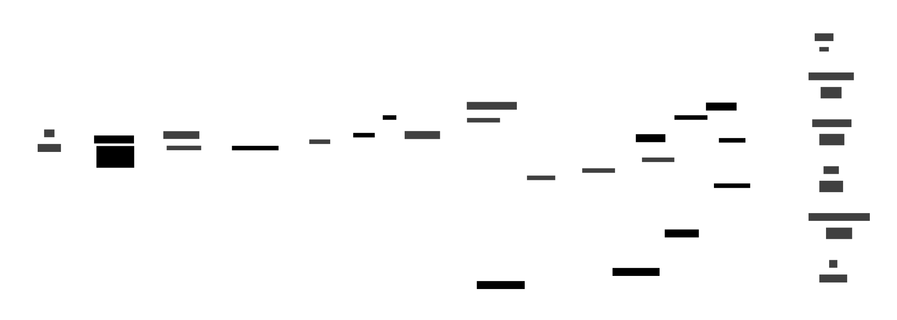
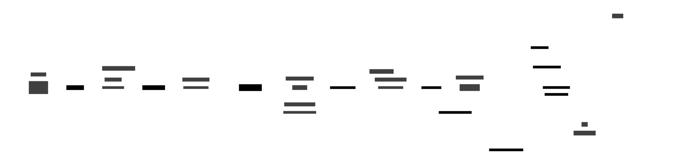

# Architecture

Rig is a local macOS CLI for running AI-assisted coding tasks in isolated Git
worktrees. The foreground `rig` process runs a Bubble Tea TUI, while a
background task daemon owns durable task operations, the local Unix socket API,
and provider hook ingestion.

The main runtime loop is:

1. The foreground `rig` command ensures the task daemon is running.
2. The TUI talks to the daemon over a local Unix socket using newline-delimited
   JSON envelopes.
3. The daemon uses `core.TaskService` to create worktrees, start tmux sessions,
   install Codex hook forwarding, persist state in SQLite, and publish live
   task status updates.
4. Codex runs inside tmux. Its hooks post back to the daemon's loopback HTTP
   hook server, which updates SQLite and any active TUI subscriptions.

## High-Level Architecture

| Component | Role |
|-----------|------|
| **TUI** | Bubble Tea frontend launched by `rig`. It renders task rows, creates tasks, opens tmux sessions, deletes tasks, and subscribes to live task status. |
| **Task daemon frontend** | Foreground client in `internal/adapters/taskdaemon/frontend.go`. It turns TUI calls into Unix socket requests. `AttachTaskSession` stays local because it needs the foreground terminal. |
| **Unix socket server** | Local daemon transport in `internal/adapters/taskdaemon/unix_socket_server.go`. It serves JSON commands such as `list_tasks`, `create_task`, `subscribe_task_status`, `delete_task`, and `reconnect_task_session`. |
| **HTTP hook server** | Loopback-only daemon transport in `internal/adapters/taskdaemon/http_hook_server.go`. It exposes `/codex-hook` and `/hook` for provider hook events. |
| **Core task service** | Application boundary in `internal/core/task_service.go`. It coordinates Git, tmux, Codex, workspace setup, PR lookup, and SQLite persistence. |
| **SQLite** | Durable local task store. It holds tasks, latest task status, activity snippets, resume metadata, and observed provider sessions. |
| **Git worktrees** | Isolated task workspaces created next to the source repository. Prompt tasks get a new branch; PR tasks reuse the PR branch. |
| **tmux** | Runtime isolation for task sessions. Each task gets a tmux session with a `task` window for Codex and an `editor` window. |
| **Codex provider** | Provider adapter that suggests task names, installs hooks into `CODEX_HOME`, launches `codex` or `codex resume`, and maps hook events to Rig status phases. |

## TUI, Socket, and Daemon Lifecycle

The foreground command and background daemon are the same binary. Normal `rig`
invocations take the TUI path. Daemon invocations are re-executed children with
`RIG_MODE=task-daemon`.

### Startup and Compatibility

1. **Load config** - `rig` reads `RIG_PROVIDER`, `RIG_SQLITE_PATH`,
   `RIG_DAEMON_SOCKET_PATH`, and `RIG_DAEMON_HOOK_LISTEN_ADDRESS`.
2. **Probe socket** - the foreground process sends `health`,
   `protocol_version`, and `frontend_build_version` requests over the Unix
   socket.
3. **Spawn daemon if needed** - when no compatible daemon is available, Rig
   re-executes its own binary with `RIG_MODE=task-daemon`.
4. **Serve transports** - the daemon opens the Unix socket and loopback HTTP
   hook listener.
5. **Launch TUI** - the foreground process creates a daemon-backed
   `core.TaskFrontend` and starts the Bubble Tea program.

The compatibility probes let a freshly rebuilt `rig` restart an older daemon
instead of speaking an incompatible socket protocol.

### Socket Commands

The socket protocol is intentionally small and frontend-shaped:

| Command | Purpose |
|---------|---------|
| `list_tasks` | Load all persisted tasks for the task list. |
| `create_task` | Stream task creation progress and then the created task. |
| `latest_task_status` | Load the latest persisted status snapshot for one task. |
| `subscribe_task_status` | Keep a socket connection open and stream live updates. |
| `get_task_activity` | Load compact prompt/action snippets for the detail panel. |
| `get_task_token_usage` | Sum observed provider session token usage from transcripts. |
| `list_repo_pull_requests` | List open/draft PRs for task creation from a PR. |
| `pull_request_status` | Show PR state for an existing task branch. |
| `delete_task` | Kill tmux, remove the worktree, and delete the task row. |
| `reconnect_task_session` | Recreate a missing tmux session from provider resume metadata. |

## Task Creation

Prompt-backed task creation runs through `core.TaskService.CreateTaskWithProgress`.
The daemon streams progress events back to the TUI while the service performs
the durable work.

### Prompt Task Flow

1. **Submit prompt** - the TUI sends `create_task` with the launch cwd, prompt,
   and provider.
2. **Detect repo** - Git resolves the canonical repository root, repo name, and
   base branch.
3. **Suggest name** - Codex runs `codex exec` with the task-name prompt and
   returns a display name plus branch type.
4. **Create task row** - SQLite stores the task record before runtime resources
   are created.
5. **Create worktree** - Git creates a task branch and worktree next to the
   source repository.
6. **Prepare workspace** - Rig optionally copies configured seed files and runs a
   configured setup script, then writes provider bootstrap files.
7. **Install Codex hooks** - the Codex adapter writes
   `$CODEX_HOME/hooks/forward-to-rig.sh` and merges Rig hook rules into
   `$CODEX_HOME/hooks.json`.
8. **Start tmux** - the tmux adapter creates the session, starts `codex` in the
   `task` window, waits for the Codex ready marker, and types the prompt into the
   session.
9. **Return task** - the daemon sends a terminal `task_created` envelope back to
   the TUI.

### PR Task Flow

PR-backed task creation skips Codex name suggestion. The chosen PR title or
branch name becomes the task display name, and Git checks out the existing PR
branch into the task worktree. The rest of the flow is the same: workspace
preparation, hook installation, tmux launch, and the streamed socket result.

## Codex Hooks and Live Status

Codex hooks are how Rig observes work happening inside a tmux task session.

### Hook Installation

Before starting or reconnecting a Codex session, the provider adapter ensures:

- `$CODEX_HOME/hooks/forward-to-rig.sh` exists with executable permissions.
- `$CODEX_HOME/hooks.json` contains Rig hook rules for `SessionStart`,
  `UserPromptSubmit`, `PreToolUse`, `PermissionRequest`, `PostToolUse`, and
  `Stop`.
- The generated command passes the event name to the forwarder script.
- The forwarder posts the raw hook payload to `http://127.0.0.1:4124/codex-hook`
  by default, or to the daemon-configured collector URL.

The daemon also generates a per-process hook secret and requires the forwarder to
send it in `X-Rig-Hook-Secret`.

### Hook Ingestion

1. **Codex emits a hook** - Codex runs the generated shell command and sends the
   hook payload on stdin.
2. **Forwarder posts HTTP** - `forward-to-rig.sh` stores stdin in a temp file and
   posts it to the daemon with `X-Codex-Hook-Event` and `X-Rig-Hook-Secret`.
3. **HTTP handler decodes payload** - the Codex hook handler extracts task ID,
   session ID, cwd, transcript path, prompt text, command text, model, and the
   last assistant message.
4. **Core resolves task** - when the payload has no task ID, the service matches
   the hook cwd to a persisted task worktree.
5. **Persist provider session** - session ID, transcript path, model, cwd, and
   last event are upserted in `task_provider_sessions`.
6. **Persist resume metadata** - the latest provider session ID is stored in
   `task_resume_metadata` so Rig can later run `codex resume <session_id>`.
7. **Record activity** - user prompts, tool commands, and stop messages are
   compacted into `task_activity` for the TUI detail panel.
8. **Map status** - the Codex adapter maps hook events to Rig phases:
   - `SessionStart` -> `starting`
   - `UserPromptSubmit`, `PreToolUse`, `PostToolUse` -> `working`
   - `PermissionRequest`, `Stop` -> `waiting_for_input`
9. **Publish update** - SQLite upserts the latest `task_status` row and fans the
   update out to in-process subscribers. The socket server forwards those updates
   to any TUI `subscribe_task_status` connection.

## Runtime Status and tmux

The latest hook status is not the only status signal. When the TUI asks for the
latest task status, the service also inspects tmux. If the last known status was
active but the expected provider command is no longer running in the task pane,
the service returns a derived `stopped` status with raw event
`TaskSessionStopped`.

Opening a task session is deliberately not served by the daemon. The foreground
frontend calls tmux directly so `tmux attach-session` or `tmux switch-client`
can use the user's current terminal.

## SQLite Read Models

SQLite is both the durable task registry and the in-process fanout point for live
status subscriptions.

| Table | Purpose |
|-------|---------|
| `tasks` | Durable task records: prompt, repo, branch, worktree, tmux session, provider, timestamps. |
| `task_status` | Latest known provider status per task. |
| `task_activity` | Compact activity snippets for the TUI detail panel. |
| `task_resume_metadata` | Latest provider session ID needed to reconnect a lost tmux session. |
| `task_provider_sessions` | Observed provider sessions and transcript paths used for token usage aggregation. |

The repository applies SQLite bootstrap PRAGMAs, runs Goose migrations from
embedded SQL, rejects stale schemas that would lose data, and secures the
database files after opening the connection.
